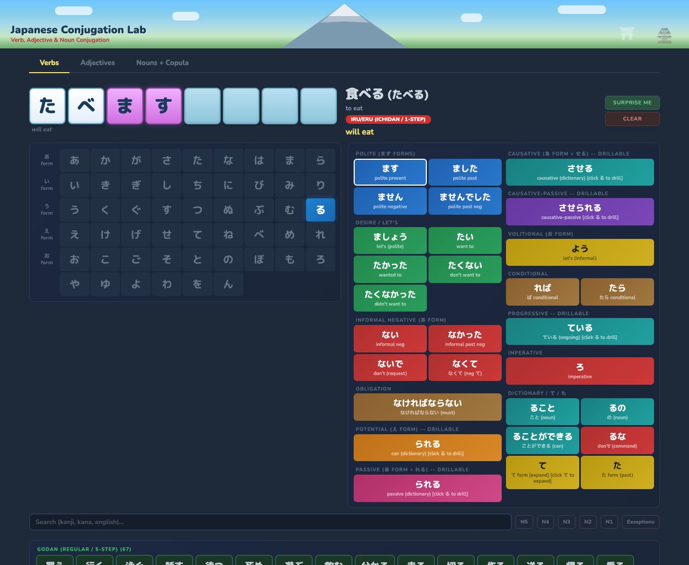

# Japanese Conjugation Lab

An interactive web tool for exploring Japanese conjugation patterns across verbs, adjectives, and nouns. Select a word, click through conjugation forms, and watch conjugated words build character by character.

Try it live: [https://mlongob.github.io/japanese-conjugation-lab/](https://mlongob.github.io/japanese-conjugation-lab/)



## Credits & Inspiration

This project was heavily inspired by the Verb Lab tool created by George Trombley / Japanese From Zero!, as demonstrated in the YouTube video ["Ultimate Guide to Conjugating ANY JAPANESE VERB!"](https://www.youtube.com/watch?v=p4otUnLHcb4). This is an independent recreation for personal learning purposes and is not affiliated with Japanese From Zero! or YesJapan.com.

## Features

**Navigation & Search**
- Tab-based navigation: Verbs, Adjectives, and Nouns + Copula
- Search by kanji, kana, romaji, or English meaning
- JLPT level filtering (N5-N1) and godan exception filter
- Shareable URL state -- every interaction updates the URL
- 215+ words tagged with JLPT levels

**Verb Conjugation**
- Interactive hiragana chart showing the 5-step (godan) conjugation system
- Click-to-remove る interaction for ichidan verbs
- Polite, negative, potential, passive, causative, causative-passive forms
- Conditional (ば / たら), progressive (ている), imperative, volitional
- Obligation (なければならない), ability (ことができる), negative て (なくて)
- Recursive drill-down: compound forms produce new conjugatable verbs
- て form expansion: 12 compounds (てしまう, てみる, ておく, てある, てください, てもいい, etc.)
- Irregular verb support: する, 来る, ある and their compounds (勉強する, etc.)
- Iru/eru godan exception verbs flagged for learners

**Adjective Conjugation**
- い-adjectives: present, past, negative, て form, conditional, adverbial, attributive
- な-adjectives: copula-based conjugation (だ/です, だった/でした, じゃない, etc.)
- Drillable compounds: すぎる (too much), なる (become), する (make)
- Appearance (そう), probability (だろう/でしょう)
- Irregular いい handling (よ stem, よさそう)

**Noun + Copula Conjugation**
- Full copula conjugation: だ/です, だった/でした, じゃない/ではありません
- て form (で), conditional (なら/だったら), attributive (の)
- Probability (だろう/でしょう)

**Technical**
- No dependencies, no build step -- just open index.html
- Vanilla HTML, CSS, and JavaScript
- Compact tile system for long conjugated forms

## Word Types

### Verbs
- **Godan (5-step):** The verb ending cycles through all five vowel rows of the hiragana chart depending on the conjugation form. These are the most common Japanese verbs.
- **Ichidan (1-step):** The verb stem is formed by simply dropping the final る. All conjugation suffixes attach directly to the stem.
- **Irregular:** する (to do), 来る (to come), and ある (to exist) follow unique conjugation patterns. Compound する/来る verbs share the same patterns.

### Adjectives
- **い-adjectives:** Drop the final い and add conjugation suffixes (かった, くない, くて, etc.). The irregular いい conjugates with a よ stem.
- **な-adjectives:** Add copula-based endings directly to the stem (だ, です, だった, じゃない, etc.).

### Nouns + Copula
- Nouns conjugate through the copula (だ/です) to express state of being, following the same pattern as な-adjectives but with の for attribution.

## Usage

No build step or dependencies required. To run locally:

1. Clone or download this repository
2. Open `index.html` in any modern web browser

Alternatively, serve the directory with any static file server:

```
python3 -m http.server 8000
```

Then visit `http://localhost:8000` in your browser.

## License

MIT
